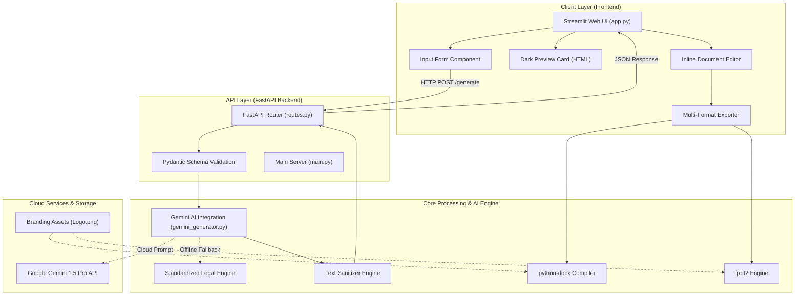

# Phase 3: Project Design Phase
## Document: System Architecture Document

---

### 1. High-Level Architectural Overview

LegalEase implements a modular, service-oriented multi-tier architecture designed for separation of concerns, high throughput, and developer extensibility.

---

### 2. Tier Breakdown & Responsibilities

#### 2.1 Presentation Tier (Frontend)
- **Technology:** Streamlit 1.32+
- **File:** `frontend/app.py`
- **Role:** Handles user interaction, form inputs, local state (`st.session_state`), live previews, inline revisions, and client downloads.
- **Resilience:** Gracefully falls back to direct internal core generator if backend API is offline during quick local runs.

#### 2.2 Application Tier (Backend API)
- **Technology:** FastAPI 0.110+, Uvicorn ASGI Server
- **Files:** `legalEaseAPI/main.py`, `legalEaseAPI/routes.py`
- **Role:** Exposes `/generate` endpoint, validates schema with Pydantic, performs error handling and logging, and returns normalized JSON responses.

#### 2.3 Core Intelligence & Export Tier
- **Technology:** Google Generative AI SDK, python-docx, fpdf2, Pillow
- **Files:** `ai_core/gemini_generator.py`, `ai_core/generator.py`
- **Role:**
  - `GeminiDocumentGenerator`: Formulates legal prompt, executes AI inference, or invokes the pre-templated legal draft generator.
  - `sanitize_text`: Cleans special characters and typographic quotes.
  - `format_docx`: Compiles Word documents with logo, Times New Roman, terms table, and legal footer.
  - `format_pdf`: Builds high-res PDF with header logo, margins, and legal disclaimer footer.
  - `format_html_preview`: Stylizes document into dark-theme HTML.

---

### 3. Design Patterns Utilized
1. **Model-View-Controller (MVC):** Frontend acts as View/Controller; FastAPI acts as Controller; AI Core acts as Model.
2. **Strategy Pattern:** Generator selects between Google Gemini API strategy and Offline Template strategy based on API key availability.
3. **Builder Pattern:** `format_docx` and `format_pdf` construct complex multi-page documents incrementally from text blocks.
4. **Adapter Pattern:** `sanitize_text` normalizes incompatible string encodings for safe downstream file writing.
