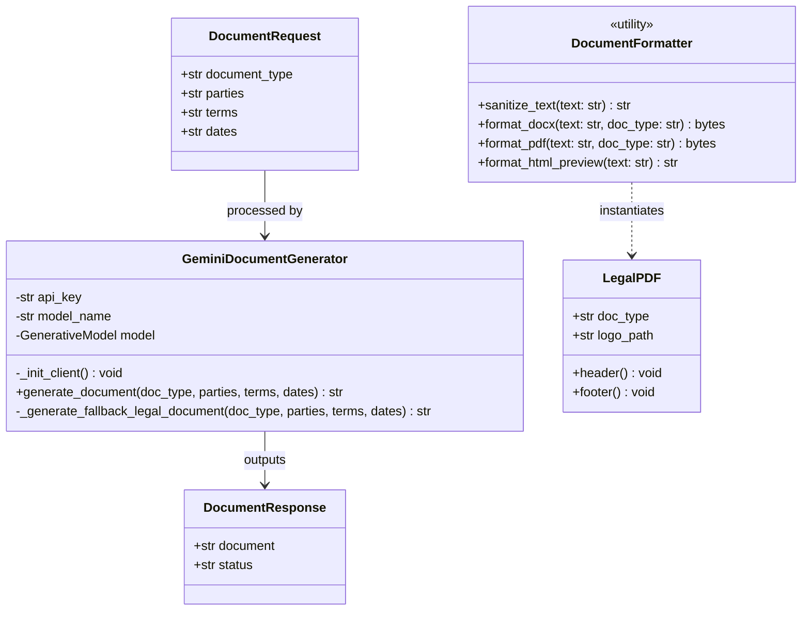
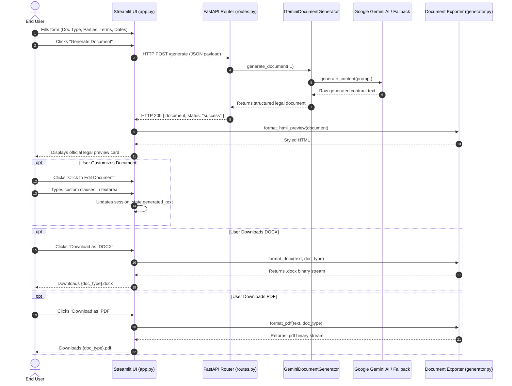
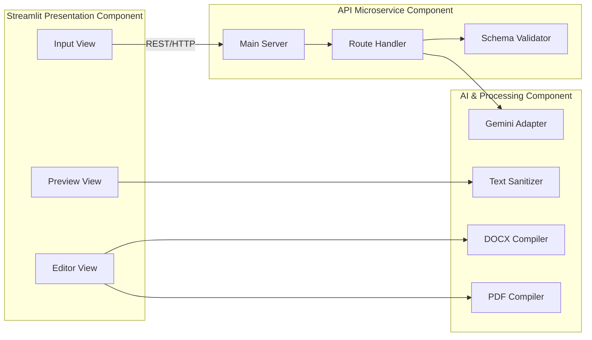

# Phase 3: Project Design Phase
## Document: UML Diagrams (Class, Sequence & Component)

---

### 1. UML Class Diagram

---

### 2. UML Sequence Diagram: End-to-End Generation & Export

---

### 3. UML Component Diagram

