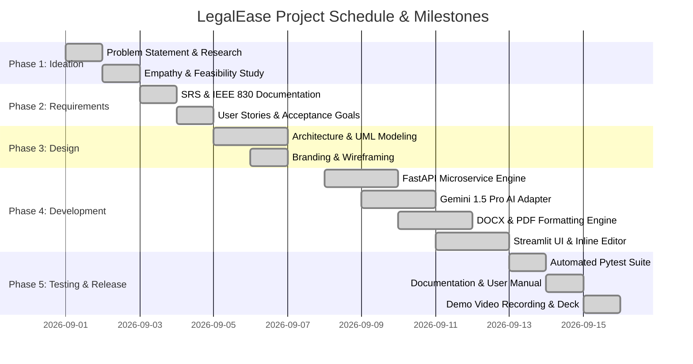

# Phase 4: Project Planning Phase
## Document: Project Schedule & Gantt Chart

---

### 1. Project Schedule Overview
The project was executed following an Agile methodology structured into 4 sequential project phases over a standard development timeline:

- **Sprint 1 (Ideation & Requirements):** Days 1–3
- **Sprint 2 (System Design & Architecture):** Days 4–6
- **Sprint 3 (Core Implementation & AI Integration):** Days 7–12
- **Sprint 4 (Testing, Documentation & Video Demonstration):** Days 13–15

---

### 2. Mermaid Gantt Chart

---

### 3. Key Milestone Deadlines

| Milestone ID | Description | Target Date | Status |
| :--- | :--- | :--- | :--- |
| **M1** | Model Selection & Architecture Finalization | Day 3 | Completed |
| **M2** | Core AI Generation & Export Engine Built | Day 7 | Completed |
| **M3** | FastAPI Backend Integration Completed | Day 10 | Completed |
| **M4** | Streamlit Frontend & Inline Editor Finalized | Day 13 | Completed |
| **M5** | Automated Tests Passed (10/10) & Docs Complete | Day 15 | Completed |
| **M6** | Final Phase-Wise Package Ready for GitHub & Video | Day 16 | Completed |
